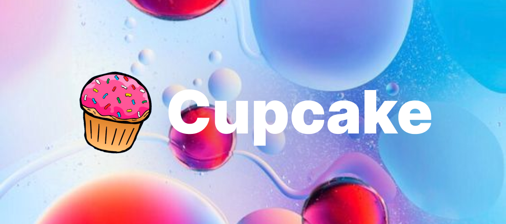

<p align="center">Library for working with the VK «Кексик» payment app</p>

<div align="center">
	<a href="https://pkg.go.dev/github.com/immersivesky/cupcakego">
		
	</a>
	<a href="http://www.opensource.org/licenses/MIT">
		
	</a>
</div>

<h2 align="center">Installation</h2>

```bash
go get github.com/immersivesky/cupcakego
```

<h2 align="center">Getting Started</h2>

Methods:
```go
package main

import "github.com/immersivesky/cupcakego/API"

func main() {
    app := API.Create(os.Getenv("TOKEN"), 123)
    fmt.Println(app.Balance())
}
```

Callback API:
```go
package main

import (
    "github.com/immersivesky/cupcakego/API"
    "github.com/immersivesky/cupcakego/callback"
)

func main() {
    var (
        app = fiber.New()
        session = callback.Create(API.Create(os.Getenv("TOKEN"), 123))
    )

    session.Donate(func(app *API.Options, donate update.Donate) {
        fmt.Printf("New donate: %+v\n", donate)
    })

    app.Post("/cupcake/:confirmation", session.Fiber)
    app.Listen(":3000")
}
```